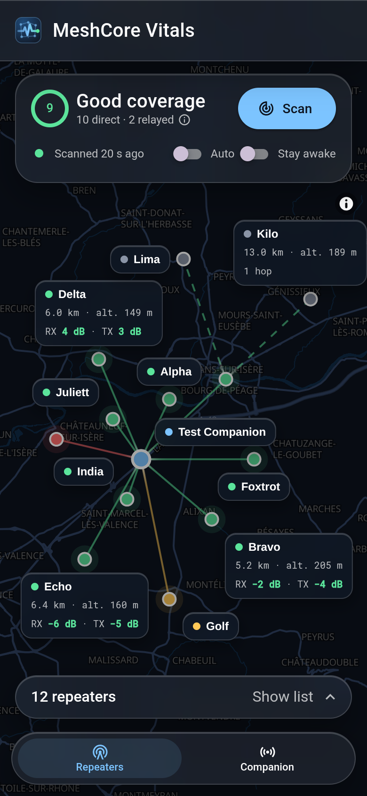
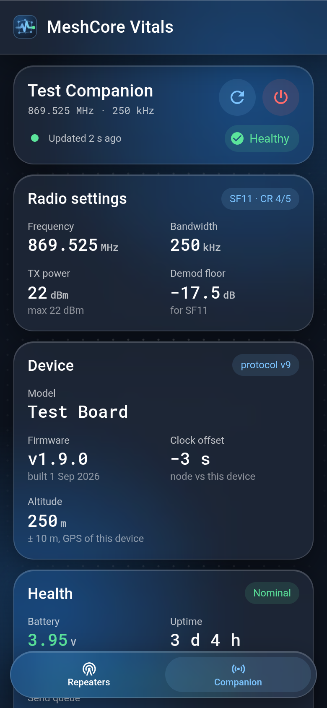

# MeshCore Vitals

Check which repeaters hear you and how good each link is, from where you stand.

[](https://github.com/8Thomas8/meshcore-vitals/actions/workflows/ci.yml)
[](LICENSE)


<p>
  
  
</p>

## What it does

The app connects to a MeshCore companion over Bluetooth from the browser. Press Scan and the repeaters in range answer with how well they hear you. You get the signal both ways, a coverage score and a map with every repeater, direct or relayed.

The Companion page shows the radio settings, battery, noise floor, traffic and a few health checks.

Works on a phone and can be installed as an app. English and French.

## Requirements

- A MeshCore companion radio with Bluetooth and a recent firmware
- Chrome or Edge on desktop or Android, or the Bluefy browser on iOS (Firefox and Safari have no Web Bluetooth)
- Location access for the map

## Releases

Commits follow Conventional Commits. release-please opens a release PR on `master`, and merging it tags the version and deploys the site to Vercel.

## Contributing

Bug or feature idea? Open an issue.

To work on the code, fork the repository and create a branch, then:

```sh
pnpm install
pnpm dev
```

Open http://localhost:3000 (Node 24, see `.nvmrc`). Before opening a pull request against `master`, check that `pnpm lint`, `pnpm typecheck` and `pnpm test` pass. Use Conventional Commits for the PR title (`feat: ...`, `fix: ...`). `pnpm build` outputs the static site.

## Privacy

The app has no backend and no tracking. It only loads map tiles from OpenFreeMap, fonts from Google Fonts, and ground elevation from Open-Meteo (repeater positions, and yours when the GPS gives no altitude).

## License

MIT
